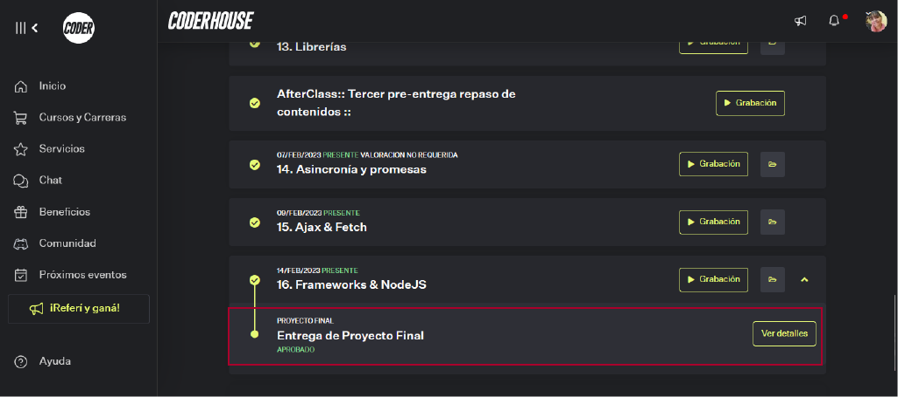
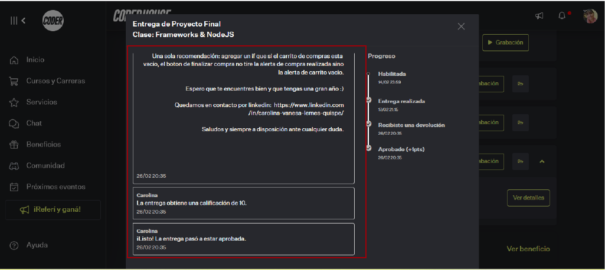

# PF-JS-ArguelloMariaSoledad:  Simulador Interactivo (Ultima parte)
    Deberás entregar el simulador final funcionando, en un archivo 
    HTML con sus archivos JS complementarios.
      
### DEMO: https://sole-arguello.github.io/PF-JS-ArguelloMariaSoledad/

## Temas visto:
11. Workshop
12. Operadores avanzados
13. Librerías
14. Asincronía y promesas
15. Ajax & Fetch
16. Frameworks & NodeJS

### Objetivos generales:

     Presentar una aplicación que utilice Javascript para solucionar un problema real al usuario.
     Utilizar Javascript para mejorar la interacción y dinamismo de la página, generando 
     una interfaz coherente y atractiva.
     
### Objetivos específicos:

     * Contar con una estructura de datos clara, basada en Arrays y Objetos.
     * Utilizar funciones, condicionales e iteradores para manipular los datos de la app.
     * Generar y manipular el DOM. Crear vistas a partir de datos de la app y generar eventos para 
       responder a la interacción del usuario. Utilizar alguna librería relevante para el simulador.
     * Utilizar asincronía y fetch para cargar datos estáticos o consumir una API.

### Formato:

     Página HTML y código fuente en JavaScript. Debe identificar el apellido del alumno/a 
     en el nombre de archivo comprimido por “ProyectoFinal+Apellido”
     
### Consigna:

     Presentarás la página web interactiva en JavaScript que vienes trabajando a lo largo del curso. 
     La misma debe simular distintos procesos. Un “simulador” es un programa que soluciona ciertas 
     tareas, y proporciona al usuario información de valor, de forma coherente y prolija. Utilizarás 
     AJAX y JSON para obtener datos y diversas herramientas de JS como librerías, promises y asincronía 
     para controlar eventos en la interfaz y producir animaciones en respuesta.

### Se debe entregar:

     * Objetos y Arrays. Métodos de Arrays
     * Funciones y condicionales.
     * Generación del DOM de forma dinámica. Eventos.
     * Sintaxis avanzada.
     * Al menos una librería de uso relevante para el proyecto
     * Manejo de promesas con fetch.
     * Carga de datos desde un JSON local o desde una API externa.
     
### Nota obtenida:

### Devolucion:

